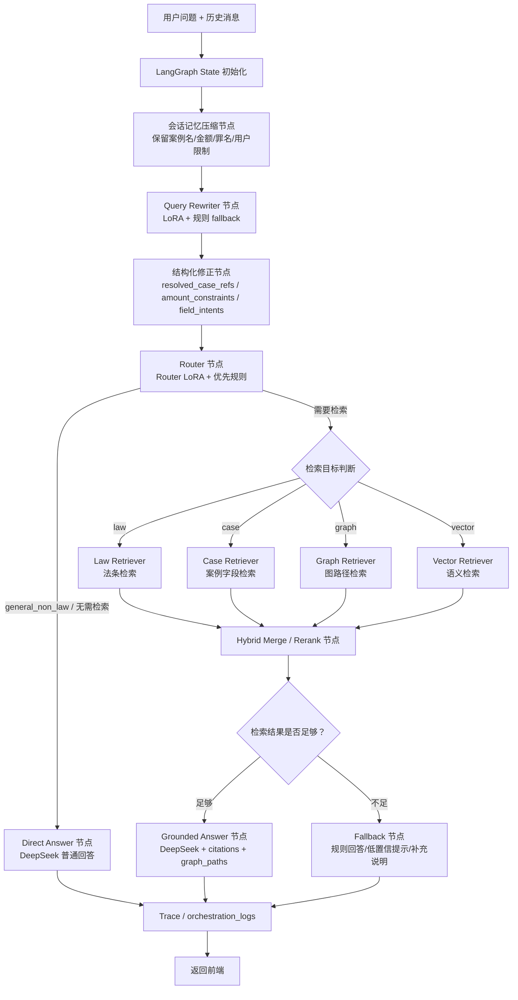

# LangChain Orchestration Runtime

## Current Boundary

The frontend runtime chain is the LangChain orchestration path. The React app calls `/api/chat/orchestration`, and `/api/chat` is kept as a compatibility endpoint that delegates to the same orchestration implementation.

Both endpoints use `processing/langchain_orchestration_sample.py` and therefore run the current Query Understanding flow:

`user messages -> Query Rewriter LoRA -> deterministic completion -> Router LoRA -> retrieval -> grounded answer/fallback`

The historical `app.llm.chat_service.answer_chat` path remains in the repository for comparison scripts and shared helper functions, but it is not the frontend answer path.

## What LangChain Does

LangChain wraps the existing GraphRAG pipeline as `RunnableLambda` nodes:

- Start Runnable: calls `understand_query`, which prefers the Rewriter-first flow when `QUERY_REWRITER_MODE=lora`.
- Router Runnable: uses the route already produced by Query Understanding.
- Lexical Retriever Runnable: calls `processing/search_sample.py`.
- Graph Retriever Runnable: calls `processing/graph_retriever_sample.py`.
- Vector Retriever Runnable: calls `processing/vector_search_sample.py` through the existing helper.
- Hybrid Merge/Rerank Runnable: calls shared merge and rerank logic from `processing/hybrid_search_sample.py`.
- Answer Runnable: reuses the grounded-answer JSON contract, confidence gate, fallback answer, citations, and graph paths from shared chat-service helpers.

LangChain is not a replacement retrieval implementation. It is the runtime orchestration layer around the custom retrieval and answer code.

## Configuration

Current runtime defaults:

```env
USE_LANGCHAIN_ORCHESTRATION=true
LLM_PROVIDER=deepseek
LLM_BASE_URL=https://api.deepseek.com/v1
LLM_MODEL=deepseek-v4-flash
QUERY_REWRITER_MODE=lora
ROUTER_MODE=lora
QUERY_UNDERSTANDING_MODE=disabled
```

`QUERY_UNDERSTANDING_MODE` is disabled because the old unified Query Understanding LoRA is not the active runtime path. If `QUERY_REWRITER_MODE` is set to `disabled`, the code can still fall back to legacy/rule behavior for debugging, but that is not the frontend chain.

The provider client is OpenAI-compatible and currently configured for DeepSeek by default. The file/class name `app/llm/minimax_client.py` is historical; it reads `LLM_PROVIDER`, `LLM_BASE_URL`, and `LLM_MODEL` from `app/config.py` and should not be interpreted as the current provider.

## API Endpoints

- `/api/chat/orchestration`: primary frontend endpoint.
- `/api/chat`: compatibility endpoint; delegates to the same orchestration chain with provider generation.

Both endpoints should be treated as the same runtime behavior for user-facing answers.

## Logs

The orchestration response returns `orchestration_logs` with these key events:

- `start`
- `router_result`
- `lexical_retriever`
- `graph_retriever`
- `vector_retriever`
- `hybrid_merge_rerank`
- `answer_contract_prepared`
- `provider_llm_output`, `provider_llm_failed`, `mock_llm_output`, or `llm_skipped`
- `final_response`

The merge/rerank log includes `enabled_retrievers`, `lexical_count`, `graph_count`, `vector_count`, `final_context_count`, `confidence`, and `warnings`.

## Target LangGraph Architecture

The long-term target is to migrate the current linear LangChain runnable chain to an explicit LangGraph state machine. This should preserve the existing Rewriter LoRA, Router LoRA, deterministic correction rules, retrieval modules, rerank logic, and grounded answer contract while making multi-turn state and conditional retrieval branches first-class.

Target runtime flow:



Target state fields should include at least:

- `messages`: original frontend conversation messages.
- `memory`: compressed structured memory, including case titles, case ordinals, crimes, amounts, field focus, and user constraints such as no-case/no-law requests.
- `rewrite_result`: Rewriter LoRA output after deterministic correction.
- `route`: Router decision after priority rules and LoRA output validation.
- `retrieval_targets`: normalized retrieval targets such as `law`, `case`, `graph`, and `vector`.
- `law_hits`, `case_hits`, `graph_hits`, `vector_hits`: retriever-specific outputs before merge.
- `merged_context`: hybrid merged and reranked retrieval context.
- `answer`: final direct, grounded, or fallback answer payload.
- `orchestration_logs`: trace events for frontend/backend audit.

Migration order:

1. Port the current orchestration behavior to LangGraph without changing answer behavior. Status: implemented as a compatibility-preserving `StateGraph` in `processing/langchain_orchestration_sample.py`; the public `run_orchestration*` functions still return the same response shape.
2. Add the structured memory node and keep it conservative: extract case names, ordinals, crimes, amounts, field intents, and user constraints instead of free-form summarization. Status: implemented as `memory_summary`; it stores structured memory and logs counts/constraints without free-form summarization.
3. Split retrieval into explicit conditional law/case/graph/vector branches controlled by Router output. Status: implemented with normalized retrieval targets, explicit `law_retriever`, `case_retriever`, `graph_retriever`, and `vector_retriever` nodes, plus a compatibility `lexical_retriever` aggregate log.
4. Add an evidence sufficiency node before answer generation. Status: implemented as `evidence_sufficiency`, using merged context count, route, and confidence level before answer preparation.
5. Keep all fallback behavior user-safe: provider failures, low-confidence retrieval, and missing evidence must not be exposed as raw internal errors. Status: implemented with explicit LangGraph conditional edges from Router to `direct_answer` or retrieval, and from `evidence_sufficiency` to `grounded_answer` or `fallback_answer`; all paths converge through `final_response`.

## Legacy Comparison

Scripts such as `processing/chat_vs_orchestration_eval.py` may still import `answer_chat` to compare old and new behavior. Those scripts are diagnostic only and should not be interpreted as the frontend runtime path.
