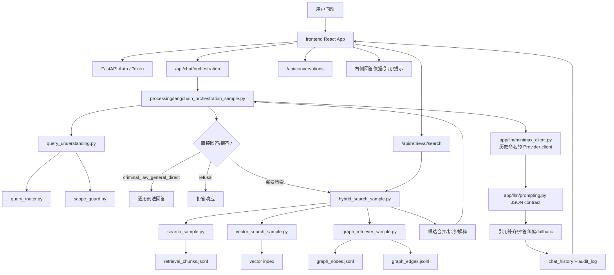
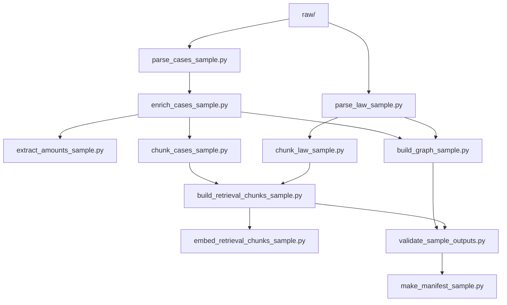
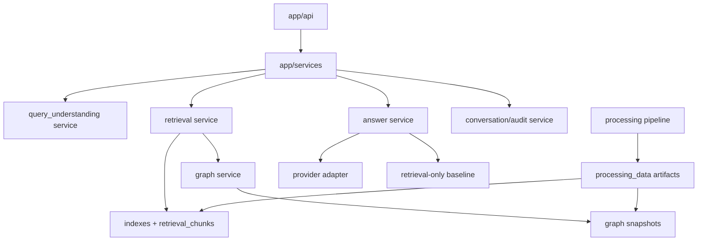

# GraphRAG-V1 Architecture Review

审计日期：2026-06-01  
依据：当前代码调用关系，而不是历史设计文档。

## 当前真实架构总览

## 入口与调用链

### 前端主链路

当前前端主要通过 `frontend/src/api.ts` 调用后端 orchestration chat。用户问题进入：

1. `frontend/src/App.tsx`
2. `app/api/routes/chat.py`
3. `run_orchestration_with_mode`
4. `processing/langchain_orchestration_sample.py`
5. Query Understanding / Retrieval / DeepSeek/OpenAI-compatible Provider
6. `app/chat_history.py` 保存对话、回答、依据
7. 前端展示答案与依据

实现状态：已实现。  
风险：接口名仍叫 orchestration，语义上像实验接口，但实际已经是主体验链路。

### Stable chat 链路

`/api/chat` 仍存在，调用：

1. `app/api/routes/chat.py`
2. `app/llm/chat_service.py`
3. `processing/query_understanding.py`
4. `processing/query_router.py`
5. `processing/hybrid_search_sample.py`
6. DeepSeek/OpenAI-compatible Provider 或 retrieval-only fallback

实现状态：已实现。  
风险：与 orchestration 链路重复，后续容易漂移。

### Retrieval API 链路

`/api/retrieval/search` 调用：

1. `app/api/routes/retrieval.py`
2. `processing/hybrid_search_sample.py`
3. lexical/vector/graph retrievers

实现状态：已实现。  
风险：直接暴露 hybrid sample 模块，schema 演进时要小心兼容。

## 数据流水线架构

实现状态：已实现。  
特点：数据产物集中在 `processing_data/`，raw 数据保持不可变。  
风险：pipeline 文件仍全部带 sample 命名，但对当前项目而言已经是正式样本数据生产链路。

## 模块实现状态

| 模块 | 当前状态 | 说明 |
|---|---|---|
| Raw data immutability | 已实现 | raw 数据与 generated data 分离 |
| Law parsing | 已实现 | 生成 law article/chunk |
| Case parsing | 已实现 | 生成 case raw/enriched |
| Case enrichment | 已实现 | 罪名、字段、引用、金额等抽取 |
| Chunking | 已实现 | law/case 分别 chunk，保留字段来源 |
| Amount extraction | 部分实现 | 已用于金额匹配，但金额角色仍需增强 |
| Graph build | 已实现 | nodes/edges 已生成 |
| Law normalization | 部分实现 | current/1979/司法解释等已考虑，但全量泛化未验证 |
| Lexical retrieval | 已实现 | `search_sample.py` |
| Vector retrieval | 已实现 | 本地向量索引 |
| Graph retrieval | 已实现 | 已参与候选生成并输出 graph paths |
| Hybrid ranking | 已实现 | 合并 lexical/vector/graph，含 explainable scoring |
| Query Understanding | 部分实现 | LoRA + 规则后处理 + 历史上下文 |
| Scope guard | 已实现 | 刑法范围/违法规避/拒答 |
| Provider orchestration | 部分实现 | JSON contract/fallback 已有，但稳定性仍是风险 |
| Stable API | 已实现 | `/api/chat`、`/api/retrieval/search` |
| Orchestration API | 已实现 | 当前前端主链路 |
| Chat history | 已实现 | SQLite 保存对话和依据 |
| Frontend | 已实现 | 登录、会话、问答、依据展示 |
| Eval suite | 已实现 | lexical/vector/hybrid/graph/answer/adversarial/orchestration |
| Hidden eval | 已实现为验收资产 | 是否长期维护需看后续流程 |

## 当前架构优势

1. 检索链路完整  
   lexical、vector、graph 三路召回都有独立实现和评测入口，hybrid merge 可解释。

2. 数据可追溯  
   chunk、graph edge、retrieval result 都尽量保留来源字段、条号、版本、source 信息。

3. 前后端闭环完整  
   用户可通过网页提问，后端保存问题、回答和依据，便于排障。

4. 评测意识强  
   项目保留了多类 eval、adversarial eval、hidden eval 和 replay 工具。

5. 样本级产品体验已经成型  
   不只是脚本验证，已经有认证、历史对话、引用依据和提示展示。

## 当前架构不一致

### 1. `processing/` 同时承担数据处理和运行时检索

理想情况下：

- `processing/` 只负责离线数据构建。
- 运行时服务应从 `app/services/retrieval` 或独立 package 读取稳定产物。

当前情况：

- `app/processing_bridge.py` 修改 import path。
- API 直接调用 `processing/hybrid_search_sample.py`。
- Orchestration 放在 `processing/langchain_orchestration_sample.py`。

影响：短期可用，长期维护边界不清。

### 2. Stable 与 Orchestration 回答路径并行

当前两条路径都能回答问题：

- Stable：`app/llm/chat_service.py`
- Orchestration：`processing/langchain_orchestration_sample.py`

影响：

- 同样的输入可能有不同 answer_type、confidence、fallback 文案。
- 修复 Provider 或拒答逻辑时容易漏掉一边。

### 3. Router 到 Query Understanding 的迁移未完全收口

旧目标：判断是否检索、检索什么。  
新目标：统一输出改写、实体、范围、意图、上下文、拒答策略。

当前仍保留：

- 旧 router 训练链路。
- 新 QU 训练链路。
- 规则后处理。
- scope guard。

影响：能力越来越强，但责任边界变复杂。

### 4. 图谱既是召回器又是解释器

当前 graph retriever 既输出候选，也输出 paths。  
这对样本级演示有利，但长期应区分：

- Candidate generation path
- Explanation path
- Audit/debug path

### 5. Provider 与 retrieval-only baseline 的关系不够明确

系统已有 fallback，但对用户来说不应看到“Provider 调用失败”这类技术细节。  
当前代码已经朝这个方向调整，但架构上仍需要把：

- Provider error
- Retrieval confidence
- Refusal reason
- User-facing answer

严格分层。

## 建议的目标架构

不要求本轮实现，仅作为后续方向。

迁移原则：

1. 不改变现有产物格式。
2. 先包装，不重写。
3. API 只依赖 service 层，不直接 import sample 脚本。
4. eval 可以继续调用底层模块，但 runtime 合同要稳定。

## 架构风险排序

1. Provider 编排风险  
   JSON contract、重试、fallback、引用补齐和拒答策略必须统一。

2. 多轮上下文风险  
   用户会大量使用“这个案子”“第一个参考案例”“有没有类似的”，当前仍是最脆弱区域。

3. 样本命名风险  
   sample 文件已经承担正式角色，后续新开发者容易误删或绕开。

4. 双回答链路风险  
   stable/orchestration 的漂移风险已经超过了它们带来的收益。

5. 数据规模风险  
   150 案例下表现不代表 1000/10000/全量下的性能、索引、质量报告都成立。

## 架构审计结论

当前架构适合“高质量样本级 GraphRAG 原型”，已经具备完整端到端闭环。它还不是干净的生产架构，主要原因是运行时与离线处理耦合、回答链路重复、Query Understanding 迁移尚未完全收口。

下一阶段最有价值的架构工作不是增加功能，而是做一次温和收敛：把 sample runtime 模块包装成正式 service，统一 answer contract，并让 Query Understanding 成为唯一的用户问题理解入口。
